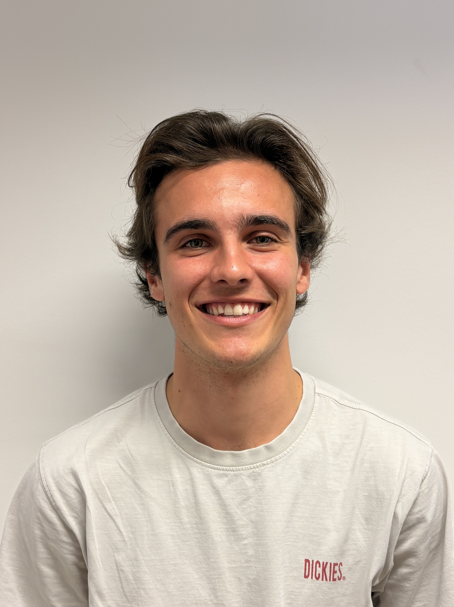
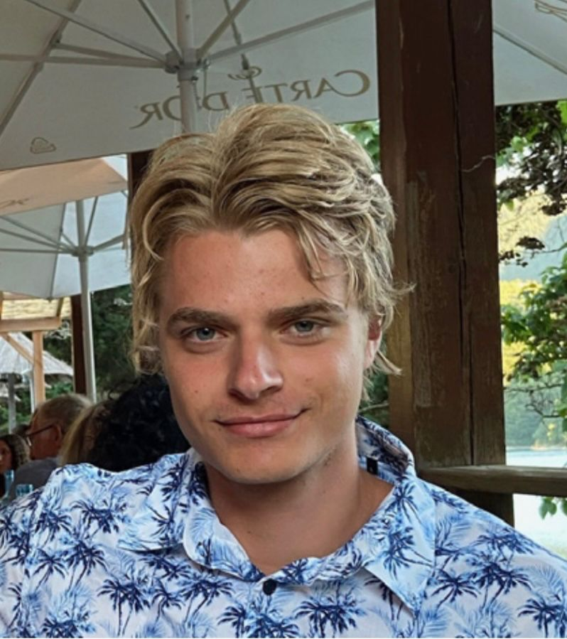

<h2>Promotors:</h2>

  <a href="https://nuclearfusion.ugent.be/prof-dr-geert-verdoolaege" target="_blank">Prof. Dr. Geert Verdoolaeghe</a> 
  <a href="https://users.ugent.be/~slazendi" target="_blank">Dr. Srđan Lazendić</a>

<h2>Team members (2025–2027):</h2>

  

    
     
    <a href="https://www.linkedin.com/in/jorrit-vander-bracht-4987b9364/" target="_blank">Jorrit Vander Bracht</a>
  

<h2>Team members (2024–2026):</h2>

  

    
     
    <a href="https://www.linkedin.com/in/felix-claeys-7b4047279/" target="_blank">Felix Claeys</a>
  

  

    
     
    <a href="https://www.linkedin.com/in/brecht-verbeken-837b4b352/" target="_blank">Brecht Verbeken</a>
  

  

    
     
    <a href="https://www.linkedin.com/in/simon-verbruggen-7ba82a324/" target="_blank">Simon Verbruggen</a>
  

<h2>Source code</h2>

  LaTeX source code for all the figures is available on GitHub (open source): 
  <a href="{{ site.github_repo }}" target="_blank">UGENT-visualisations-maths-and-physics</a>

